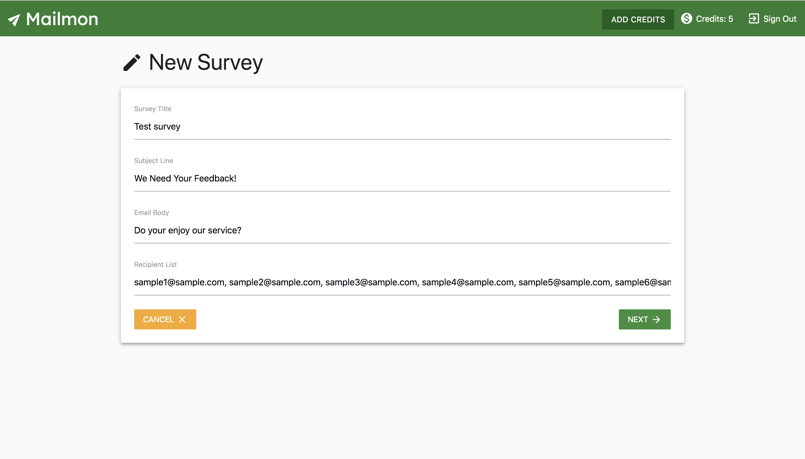

# Mailmon

Create and send surveys to your clients with [**Mailmon**](https://obscure-eyrie-95894.herokuapp.com/)

*Developed using React, Redux, NodeJS, MongoDB*

<table>
  <tr>
    <td></td>
    <td></td>
  <tr>
  <tr>
    <td></td>
    <td></td>
  <tr>
  <tr>
    <td></td>
  <tr>
</table>
